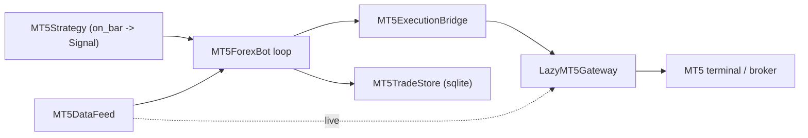

# mt5-trade Forex Integration

This document describes the architecture and implementation plan for trading forex instruments
through a MetaTrader 5 (MT5) terminal, using a dedicated bot that connects to MT5 **directly**
via the official `MetaTrader5` Python package.

## Context from the existing system

Freqtrade is built around a candle-driven bot loop:

- Configuration selects strategy, exchange, stake, pricing, risk, and runtime mode.
- Strategies calculate indicators and entry/exit signals from completed OHLCV candles.
- The live bot loop refreshes market data, updates open orders/trades, evaluates exits,
  adjusts positions, and finally evaluates new entries.
- Exchange access is abstracted behind exchange classes, which currently assume CCXT-like
  crypto exchange semantics.
- Backtesting, hyperopt, persistence, RPC, and UI are separate from the exchange connector.

MT5 forex has a different boundary: it is a broker terminal with lot-based sizing, not a CCXT
crypto exchange. The safest design is therefore **not** to force MT5 into Freqtrade's CCXT
exchange contract. Instead, `freqtrade.mt5_trade` is a self-contained bridge + bot package that
talks to the MT5 terminal directly and runs its own trading loop.

## Design



### Responsibilities

- `models.py` — typed config (`MT5BridgeConfig`, `MT5BotConfig`), order/result models, and
  shared lot-size normalization. `from_dict` builders parse the config section.
- `config.py` — `load_mt5_config()` loads + validates the `mt5_trade` config section (local JSON
  schema, decoupled from the crypto-bot `CONF_SCHEMA`).
- `symbols.py` — maps `EUR/USD`, `EURUSD`, and `EURUSD.MT5` to consistent MT5 symbols.
- `gateway.py` — `LazyMT5Gateway` lazy-loads `MetaTrader5`, opens the terminal connection,
  selects symbols, normalizes lots, and sends MT5 order requests.
- `execution.py` — `MT5ExecutionBridge` submits orders (dry-run locally, or via the gateway).
- `data.py` — `MT5DataFeed`: `LiveMT5DataFeed` (live bars from `copy_rates_from_pos`) and
  `ReplayDataFeed` (deterministic offline bars for dry-run and tests).
- `strategy.py` — `MT5Strategy` interface (`on_bar -> Signal`) plus a `SmaCrossStrategy` demo.
- `position.py` — `plan_transitions()`: pure one-position-per-symbol decision logic shared by
  the live bot and the backtester (no stacking, reverse on opposite signal, exit closes).
- `bot.py` — `MT5ForexBot`: the loop that pulls bars, asks the strategy, manages one position
  per symbol, submits orders, applies SL/TP, reconciles with the broker, and recovers from
  per-iteration errors.
- `persistence.py` — `MT5TradeStore`, a lightweight stdlib-`sqlite3` store for orders/positions
  (independent of the CCXT-coupled SQLAlchemy `Trade`/`Order` models).
- `notifier.py` — `Notifier` sinks (`NullNotifier`, `LoggingNotifier`, `RPCNotifier`).
- `backtest.py` — `run_backtest()`: offline strategy replay with simulated fills (market +
  limit/stop) and P&L stats.
- `history.py` — `MT5HistoryDownloader`: fetch + cache historical bars as JSON.
- `runner.py` — `MT5TradeRuntime` assembles the bot from config and runs it.

### Running

```bash
# Live/dry-run trading loop
freqtrade trade-mt5 --config mt5-config.json
# Download + cache historical bars (live; writes history_file)
freqtrade download-data-mt5 --config mt5-config.json
# Backtest the configured strategy over a cached bar file (offline)
freqtrade backtest-mt5 --config mt5-config.json
```

The `trade-mt5` command loads the standalone `mt5_trade` config directly (not through the
crypto-bot config validation) and starts the bot. In dry-run with a `replay_data` file it runs
fully offline; for live trading it connects to a running MT5 terminal. `backtest-mt5` reads the
`replay_data` (or `history_file`) bar cache and runs entirely offline.

## Configuration Shape

```json
{
  "mt5_trade": {
    "terminal_path": "C:/Program Files/MetaTrader 5/terminal64.exe",
    "login": 123456,
    "password": "secret",
    "server": "Broker-Demo",
    "dry_run": true,
    "default_lot_size": 0.01,
    "deviation": 20,
    "magic": 20260606,
    "timeframe": "M5",
    "poll_interval": 5.0,
    "warmup_bars": 200,
    "reconcile_interval": 12,
    "pending_expiry": 24,
    "db_path": "mt5_trade.sqlite",
    "strategy": {"fast": 10, "slow": 30},
    "replay_data": "user_data/mt5_bars.json",
    "history_bars": 1000,
    "history_file": "user_data/mt5_bars.json",
    "data_source": {"type": "mt5"},
    "trade_symbols": ["EURUSD"],
    "symbols": [
      {"venue": "MT5", "base": "EUR", "quote": "USD", "mt5_symbol": "EURUSD"},
      {"venue": "MT5", "base": "GBP", "quote": "USD", "mt5_symbol": "GBPUSD"}
    ]
  }
}
```

- `trade_symbols` selects which mapped symbols the bot trades (defaults to all mapped symbols).
- `replay_data` (optional) points to a JSON file mapping `symbol -> [[time,o,h,l,c,v], ...]`;
  when present the bot replays it offline instead of using the live MT5 feed.
- `strategy` parameters are passed to the default `SmaCrossStrategy`.
- `M5TrendM1EntryStrategy` can enable `use_h1_filter` so H1 controls direction before M5/M1
  entries are allowed. With the default `h1_fast=9`, `h1_slow=26`, and
  `h1_slope_lookback=3`, a long requires H1 EMA9 above EMA26, price above EMA26, and a rising
  EMA26; shorts require the inverse. `h1_filter_mode="strict"` also blocks entries while H1 is
  neutral, while `"block_opposite"` allows neutral regimes but rejects trades directly against
  the H1 bias. Use at least `warmup_bars=2000` for an M1 feed so enough completed H1 candles are
  available.
- Sideways filtering can be volatility-adjusted with `trend_min_spread_atr`: the absolute
  distance between the M5 fast/slow EMAs must be at least that multiple of M5 ATR. Optional
  `trend_require_spread_expansion` and `trend_require_slow_slope` gates are available for more
  restrictive setups. For XAUUSD M1 tests, `trend_atr_length=14` and
  `trend_min_spread_atr=0.3` are used with a full-position `risk_reward=1.0`.
- `reconcile_interval` (optional, live only) reconciles with broker positions every N
  iterations; `0` reconciles only at startup.
- `history_bars` / `history_file` configure `download-data-mt5`: how many recent bars to fetch
  and where to write the JSON cache (which `backtest-mt5`/`replay_data` then consume).
- `history_from` / `history_to` (ISO datetimes, optional) make `download-data-mt5` fetch a
  date range instead of the most-recent `history_bars`.
- `data_source` selects where `download-data-mt5` gets bars from. `{"type": "mt5"}` keeps the
  original Windows/terminal path. `{"type": "csv", ...}` and `{"type": "json", ...}` run fully
  offline on macOS/Linux. `{"type": "dukascopy", ...}` downloads public Dukascopy hourly tick
  `.bi5` files and aggregates them to the configured timeframe. All sources write the same
  `history_file` replay cache used by `backtest-mt5`.
- `pending_expiry` (optional, live only) cancels a resting pending order after it has lived this
  many iterations; `0` disables bot-side expiry.

CSV source example for offline Mac backtests:

```json
{
  "data_source": {
    "type": "csv",
    "paths": {"EURUSD": "user_data/source/EURUSD_M5.csv"},
    "time_column": "time",
    "open_column": "open",
    "high_column": "high",
    "low_column": "low",
    "close_column": "close",
    "volume_column": "volume",
    "timezone": "UTC"
  }
}
```

Dukascopy source example:

```json
{
  "data_source": {
    "type": "dukascopy",
    "from": "2024-01-01T00:00:00Z",
    "to": "2024-01-02T00:00:00Z",
    "timeframe": "M5",
    "price": "bid",
    "instruments": {"EURUSD": "EURUSD"}
  }
}
```

`price` can be `bid`, `ask`, or `mid`. Dukascopy data is independent from your MT5 broker, so
symbol suffixes and spreads may not match a live broker exactly.

## XAUUSD D1/H4 Trend Strategy

`XauusdD1H4TrendStrategy` is the built-in long-horizon strategy for holding gold positions over
multiple days or weeks. It consumes completed `H1` bars and builds:

- D1 regime: EMA30/EMA150 alignment, EMA150 slope, and ADX strength. Shorts use a higher default
  ADX threshold (`20`) than longs (`15`).
- H4 entry: EMA10/EMA30 alignment plus a close outside the previous Donchian 15-bar channel.
  Breakouts are rejected when the candle true range (including a gap from the previous close)
  exceeds `2.5` previous H4 ATR, or when the close is more than
  `max_channel_breakout_atr` beyond the Donchian boundary.
- Risk: initial stop at `2.5` H4 ATR. Use `position_sizing.mode="risk_percent"`; lot size is
  calculated from the current executable bid/ask and floored to the broker's lot step. Live mode
  uses MT5 `order_calc_profit` so contract/tick value and account-currency conversion come from the
  broker. After a market fill, the bot recalculates risk from the actual fill and reduces the
  position, or closes it when no valid reduced lot can meet the cap. The growth example risks
  `0.75%` of `90%` of account equity (effective maximum `0.675%`), caps cash risk at `750`, caps
  size at `0.50` lot, and skips the trade when the broker minimum lot would exceed the risk budget.
  Live sizing prefers broker equity (including floating PnL) over balance. The strategy
  intentionally emits no fixed take-profit.
- `max_risk_amount` is denominated in the account currency. The direct stop-distance formula
  used by backtest and dry-run assumes a USD-denominated account for XAUUSD with
  `contract_size=100`; those offline modes do not perform automatic currency conversion.
- `default_lot_size` remains present as a general fallback, but it is not used for entries while
  `position_sizing.mode` is `risk_percent`.
- On the available January 2025-May 2026 XAUUSD dataset, the session-aware profile produced
  21 trades, won 15 (`71.43%`), and returned `9.55%` from a `100,000` starting balance. Twenty-one
  trades is still a small sample, and this offline result excludes intratrade equity drawdown,
  spread, swap, and live slippage; it must not be interpreted as a guaranteed risk bound.
- Exit: D1 close across EMA50, or an H4-close Chandelier stop using the highest/lowest 22 H4
  candles and `3` ATR. The Chandelier level ratchets in the profitable direction and never
  loosens. Live state is persisted with the strategy class, position side, entry price, and broker
  ticket, so the ratchet survives restart only when the restored position identity still matches.

The initial stop is installed broker-side. The Chandelier is a strategy exit evaluated when a
completed H4 candle becomes available, so it is not an intrabar broker trailing stop.
`daily_anchor_hour` controls the UTC boundary used to build D1 candles when broker sessions do
not align to midnight UTC. H4/D1 aggregation validates every expected H1 slot against the
configured metals session (`session_break_hours`, `sunday_open_hour`, and `friday_close_hour`);
unexpected gaps and shortened holiday candles are discarded. A completed Sunday fragment is
merged into Monday rather than becoming a separate D1 candle. The defaults model the Dukascopy
XAUUSD UTC session and may need adjustment for a broker with different trading hours.

The default parameters require `3720` H1 bars; configure at least `warmup_bars=4000`. A complete
Dukascopy download/backtest configuration is available at
`config_examples/mt5-xauusd-d1-h4-trend.example.json`:

```bash
freqtrade download-data-mt5 \
  --config config_examples/mt5-xauusd-d1-h4-trend.example.json
freqtrade backtest-mt5 \
  --config config_examples/mt5-xauusd-d1-h4-trend.example.json
```

## Execution Plan

**Phase 1 — Bridge primitives (done)**
1. Typed models, forex symbol mapping, lazy `MetaTrader5` gateway, execution bridge.
2. Tests for symbol mapping, config defaults, lot normalization, and MT5 order construction.

**Phase 2 — Direct-MT5 forex bot (this work)**
1. Config loader + JSON-schema validation for the `mt5_trade` section.
2. Market data feed abstraction: live (`copy_rates_from_pos`) + offline replay.
3. `MT5Strategy` interface + `SmaCrossStrategy` demo.
4. `MT5ForexBot` loop with one-position-per-symbol management (open / reverse / exit).
5. Lightweight sqlite persistence for orders and open positions.
6. `trade-mt5` CLI command.
7. End-to-end dry-run tests (offline replay + dry-run bridge).

**Phase 3 — Live hardening (implemented offline; live paths need Windows + MT5 terminal to verify)**
1. Reconciliation (`MT5ForexBot.reconcile`, `LazyMT5Gateway.open_positions`): adopt broker
   positions the bot didn't know about and drop ones closed externally, at startup and every
   `reconcile_interval` iterations. No-op in dry-run.
2. Order modify/cancel + broker-side SL/TP (`LazyMT5Gateway.modify_position_sltp` via
   `TRADE_ACTION_SLTP`, `cancel_order` via `TRADE_ACTION_REMOVE`; `MT5ExecutionBridge.modify_sltp`
   / `cancel_order`). The bot applies a signal's SL/TP after opening a position.
3. Reconnect + error recovery (`LazyMT5Gateway.ensure_connected` health probe + transparent
   reconnect; `_dispatch` retries once on a dropped link). The bot loop isolates per-iteration
   failures and stops after `max_consecutive_errors`.
4. Notifications (`Notifier`: `NullNotifier`, `LoggingNotifier`, `RPCNotifier` adapter over
   freqtrade's `RPCManager` for Telegram/Discord/webhook). The bot emits open/close/reject,
   reconciliation, and error events.
5. Backtesting (`run_backtest`): replay a strategy over historical bars with simulated fills,
   reusing `plan_transitions` so position semantics match live; reports round-trip P&L, trade
   count, and win rate.

**Phase 4 — Data, backtesting, and order types (implemented offline)**
1. Historical data download + cache (`MT5HistoryDownloader`, `download-data-mt5` CLI;
   `load_bars_json` / `dump_bars_json`) into the replay JSON format.
2. Backtesting CLI (`backtest-mt5`) over a cached bar file, printing trades, total P&L, and win
   rate via `run_backtest`.
3. Limit/stop entry orders: `Signal.order_kind` + `price` flow through `plan_transitions` to the
   order request. The backtester rests limit/stop orders until a bar's range touches the price
   (and cancels them if the strategy reverses/exits first).
4. Partial-fill handling: `MT5OrderResult.filled_volume` is parsed from the broker response and
   the bot tracks the executed (not requested) volume.
5. Pending placement awareness: a placed (not filled) pending order is recognized via
   `MT5OrderResult.is_pending`; the live bot does not record it as a held position and lets
   `reconcile()` adopt it once the broker reports the fill.

**Phase 5 — Pending-order lifecycle + dated history (implemented offline)**
1. Pending-order reconciliation (`LazyMT5Gateway.open_orders` via `orders_get`,
   `MT5ExecutionBridge.broker_orders`): the bot tracks resting orders in a pending slot, and
   `reconcile()` adopts broker orders, drops cancelled ones, and moves a filled pending into a
   position. A resting order occupies the symbol slot, so same-side signals don't stack.
2. Pending cancellation: an exit/reverse signal on a resting order cancels it
   (`MT5ExecutionBridge.cancel_order`) instead of sending a market close.
3. Dated history download: `LazyMT5Gateway.copy_rates_range` /
   `LiveMT5DataFeed.bars_range` / `MT5HistoryDownloader.download_range`; `download-data-mt5`
   uses `history_from`/`history_to` when set, else the most-recent `history_bars`.

**Phase 6 — Pending-order expiry + richer order metadata (implemented offline)**
1. Broker-side expiry: `MT5OrderRequest.expiration` (epoch seconds) and `Signal.expiration` flow
   to the order request; the gateway sets `ORDER_TIME_SPECIFIED` + `expiration` on pending orders
   (ignored for market orders) so the broker auto-cancels at the deadline.
2. Bot-side expiry: `MT5BotConfig.pending_expiry` (iterations); the bot cancels a resting order
   that has lived past the limit, independent of the broker.
3. Richer order metadata: `MT5TradeStore.mt5_orders` records `order_kind`, `price`, and
   `expiration` alongside each order.

**Phase 7 — Scale-out / breakeven / TP2 (implemented offline; live + backtest)**
1. `Signal.tp1` / `tp1_close_fraction` / `move_sl_to_breakeven` describe a partial-take-profit
   plan that flows through `plan_transitions` to both the bot and the backtester.
2. `M5TrendM1EntryStrategy` with `take_profit_mode="scale_out"` (params `tp1_rr`, default 1.0;
   `tp1_close_fraction`, default 0.5) sets TP1 = entry ± tp1_rr × risk, closes that fraction at
   TP1, moves the stop to breakeven, and lets the remainder run to the existing M5 trend exit
   (TP2). No fixed full TP in this mode.
3. Backtest (`run_backtest`): simulates TP1 partial fill (a separate trade leg), the breakeven
   stop move, and the runner exit; stop is resolved before TP on the same bar (conservative).
4. Live (`MT5ForexBot`): on each bar checks TP1 against the latest range, submits a partial close
   for the fraction, and moves the broker stop to entry. Skips the split when either leg would
   fall below the symbol's minimum lot (runs the position whole instead).

**Phase 8 — Remaining live integration (future)**
- End-to-end validation on a Windows host against a demo MT5 terminal (the only path that
  cannot be exercised off-Windows).

## Operational Constraints

- Start in `dry_run=true`; switch to live only after demo validation.
- Dry-run has no broker connection, so it validates lot sizes against the configured
  `min_lot`/`lot_step` in each symbol mapping — not the broker's live `symbol_info`. Keep those
  mapping values aligned with the broker, otherwise a volume that passes in dry-run can still be
  rejected live (and vice versa).
- The `MetaTrader5` package is Windows-only and requires a running/login-capable MT5 terminal,
  so the live path can only be exercised on Windows. Imports are kept lazy so the rest of
  Freqtrade stays importable elsewhere; the dry-run/replay path runs on any platform.
- Forex sizing is in lots, not crypto base units. Risk controls must explicitly convert strategy
  risk to broker lot sizes.
- Reconciliation (Phase 3) is mandatory before relying on live trading, because broker orders
  and positions may exist outside the bot process.
