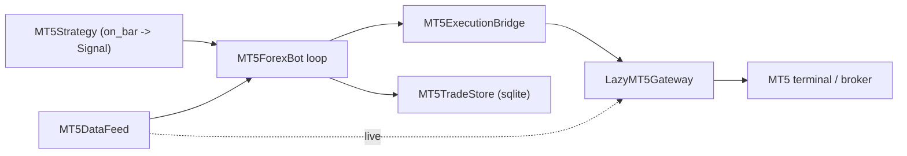

# mt5-trade Forex Integration

This document describes the architecture and implementation plan for trading forex instruments
through a MetaTrader 5 (MT5) terminal, using a dedicated bot that connects to MT5 **directly**
via the official `MetaTrader5` Python package.

## Context from the existing system

Freqtrade is built around a candle-driven bot loop:

- Configuration selects strategy, exchange, stake, pricing, risk, and runtime mode.
- Strategies calculate indicators and entry/exit signals from completed OHLCV candles.
- The live bot loop refreshes market data, updates open orders/trades, evaluates exits,
  adjusts positions, and finally evaluates new entries.
- Exchange access is abstracted behind exchange classes, which currently assume CCXT-like
  crypto exchange semantics.
- Backtesting, hyperopt, persistence, RPC, and UI are separate from the exchange connector.

MT5 forex has a different boundary: it is a broker terminal with lot-based sizing, not a CCXT
crypto exchange. The safest design is therefore **not** to force MT5 into Freqtrade's CCXT
exchange contract. Instead, `freqtrade.mt5_trade` is a self-contained bridge + bot package that
talks to the MT5 terminal directly and runs its own trading loop.

## Design



### Responsibilities

- `models.py` — typed config (`MT5BridgeConfig`, `MT5BotConfig`), order/result models, and
  shared lot-size normalization. `from_dict` builders parse the config section.
- `config.py` — `load_mt5_config()` loads + validates the `mt5_trade` config section (local JSON
  schema, decoupled from the crypto-bot `CONF_SCHEMA`).
- `symbols.py` — maps `EUR/USD`, `EURUSD`, and `EURUSD.MT5` to consistent MT5 symbols.
- `gateway.py` — `LazyMT5Gateway` lazy-loads `MetaTrader5`, opens the terminal connection,
  selects symbols, normalizes lots, and sends MT5 order requests.
- `execution.py` — `MT5ExecutionBridge` submits orders (dry-run locally, or via the gateway).
- `data.py` — `MT5DataFeed`: `LiveMT5DataFeed` (live bars from `copy_rates_from_pos`) and
  `ReplayDataFeed` (deterministic offline bars for dry-run and tests).
- `strategy.py` — `MT5Strategy` interface (`on_bar -> Signal`) plus a `SmaCrossStrategy` demo.
- `position.py` — `plan_transitions()`: pure one-position-per-symbol decision logic shared by
  the live bot and the backtester (no stacking, reverse on opposite signal, exit closes).
- `bot.py` — `MT5ForexBot`: the loop that pulls bars, asks the strategy, manages one position
  per symbol, submits orders, applies SL/TP, reconciles with the broker, and recovers from
  per-iteration errors.
- `persistence.py` — `MT5TradeStore`, a lightweight stdlib-`sqlite3` store for orders/positions
  (independent of the CCXT-coupled SQLAlchemy `Trade`/`Order` models).
- `notifier.py` — `Notifier` sinks (`NullNotifier`, `LoggingNotifier`, `RPCNotifier`).
- `backtest.py` — `run_backtest()`: offline strategy replay with simulated fills and P&L stats.
- `runner.py` — `MT5TradeRuntime` assembles the bot from config and runs it.

### Running

```bash
freqtrade trade-mt5 --config mt5-config.json
```

The `trade-mt5` command loads the standalone `mt5_trade` config directly (not through the
crypto-bot config validation) and starts the bot. In dry-run with a `replay_data` file it runs
fully offline; for live trading it connects to a running MT5 terminal.

## Configuration Shape

```json
{
  "mt5_trade": {
    "terminal_path": "C:/Program Files/MetaTrader 5/terminal64.exe",
    "login": 123456,
    "password": "secret",
    "server": "Broker-Demo",
    "dry_run": true,
    "default_lot_size": 0.01,
    "deviation": 20,
    "magic": 20260606,
    "timeframe": "M5",
    "poll_interval": 5.0,
    "warmup_bars": 200,
    "reconcile_interval": 12,
    "db_path": "mt5_trade.sqlite",
    "strategy": {"fast": 10, "slow": 30},
    "replay_data": "user_data/mt5_bars.json",
    "trade_symbols": ["EURUSD"],
    "symbols": [
      {"venue": "MT5", "base": "EUR", "quote": "USD", "mt5_symbol": "EURUSD"},
      {"venue": "MT5", "base": "GBP", "quote": "USD", "mt5_symbol": "GBPUSD"}
    ]
  }
}
```

- `trade_symbols` selects which mapped symbols the bot trades (defaults to all mapped symbols).
- `replay_data` (optional) points to a JSON file mapping `symbol -> [[time,o,h,l,c,v], ...]`;
  when present the bot replays it offline instead of using the live MT5 feed.
- `strategy` parameters are passed to the default `SmaCrossStrategy`.
- `reconcile_interval` (optional, live only) reconciles with broker positions every N
  iterations; `0` reconciles only at startup.

## Execution Plan

**Phase 1 — Bridge primitives (done)**
1. Typed models, forex symbol mapping, lazy `MetaTrader5` gateway, execution bridge.
2. Tests for symbol mapping, config defaults, lot normalization, and MT5 order construction.

**Phase 2 — Direct-MT5 forex bot (this work)**
1. Config loader + JSON-schema validation for the `mt5_trade` section.
2. Market data feed abstraction: live (`copy_rates_from_pos`) + offline replay.
3. `MT5Strategy` interface + `SmaCrossStrategy` demo.
4. `MT5ForexBot` loop with one-position-per-symbol management (open / reverse / exit).
5. Lightweight sqlite persistence for orders and open positions.
6. `trade-mt5` CLI command.
7. End-to-end dry-run tests (offline replay + dry-run bridge).

**Phase 3 — Live hardening (implemented offline; live paths need Windows + MT5 terminal to verify)**
1. Reconciliation (`MT5ForexBot.reconcile`, `LazyMT5Gateway.open_positions`): adopt broker
   positions the bot didn't know about and drop ones closed externally, at startup and every
   `reconcile_interval` iterations. No-op in dry-run.
2. Order modify/cancel + broker-side SL/TP (`LazyMT5Gateway.modify_position_sltp` via
   `TRADE_ACTION_SLTP`, `cancel_order` via `TRADE_ACTION_REMOVE`; `MT5ExecutionBridge.modify_sltp`
   / `cancel_order`). The bot applies a signal's SL/TP after opening a position.
3. Reconnect + error recovery (`LazyMT5Gateway.ensure_connected` health probe + transparent
   reconnect; `_dispatch` retries once on a dropped link). The bot loop isolates per-iteration
   failures and stops after `max_consecutive_errors`.
4. Notifications (`Notifier`: `NullNotifier`, `LoggingNotifier`, `RPCNotifier` adapter over
   freqtrade's `RPCManager` for Telegram/Discord/webhook). The bot emits open/close/reject,
   reconciliation, and error events.
5. Backtesting (`run_backtest`): replay a strategy over historical bars with simulated fills,
   reusing `plan_transitions` so position semantics match live; reports round-trip P&L, trade
   count, and win rate.

**Phase 4 — Remaining live integration (future)**
- Download/cache historical MT5 bars for backtesting input.
- Pending-order lifecycle management (limit/stop entries) and partial-fill handling.
- End-to-end validation on a Windows host against a demo MT5 terminal.

## Operational Constraints

- Start in `dry_run=true`; switch to live only after demo validation.
- Dry-run has no broker connection, so it validates lot sizes against the configured
  `min_lot`/`lot_step` in each symbol mapping — not the broker's live `symbol_info`. Keep those
  mapping values aligned with the broker, otherwise a volume that passes in dry-run can still be
  rejected live (and vice versa).
- The `MetaTrader5` package is Windows-only and requires a running/login-capable MT5 terminal,
  so the live path can only be exercised on Windows. Imports are kept lazy so the rest of
  Freqtrade stays importable elsewhere; the dry-run/replay path runs on any platform.
- Forex sizing is in lots, not crypto base units. Risk controls must explicitly convert strategy
  risk to broker lot sizes.
- Reconciliation (Phase 3) is mandatory before relying on live trading, because broker orders
  and positions may exist outside the bot process.
